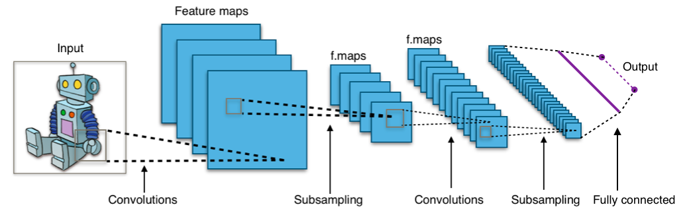

# Relazione

## Obiettivo

L'obiettivo principale di questo progetto è di apprendere come costruire e strutturare diversi tipi di reti neurali e di testarle su problemi di Reinforcement Learning, al fine di sviluppare una comprensione più approfondita di come funziona questa tecnologia e di come può essere applicata in diversi contesti.

Inoltre, durante il corso del progetto, verranno affrontati una serie di sotto-obiettivi, tra cui la comprensione dei principi fondamentali del Reinforcement Learning, l'analisi di diversi algoritmi di apprendimento automatico utilizzati nelle reti neurali, lo studio delle tecniche di elaborazione dei dati utilizzate per preparare i dati di input per le reti neurali, e l'implementazione di un'architettura di rete neurale per risolvere problemi di Reinforcement Learning.

## Tools Usati

### Gym

**Gym** è una libreria open-source di OpenAI che permette di creare e testare algoritmi di apprendimento automatico su problemi di Reinforcement Learning. La libreria include una vasta gamma di ambienti, come il classico gioco del CartPole e altri giochi Atari, e offre un'interfaccia standardizzata per l'interazione con questi ambienti di gioco. In questo caso specifico Gym è stato usato sia per essere dato direttamente come input a una rete, che come creatore di un dataset di sequenze.

### Stable-Baselines3

**Stable-Baselines3** è una libreria open-source di apprendimento automatico che si concentra su algoritmi di reinforcement learning. È costruita sulla libreria di machine learning PyTorch e offre una vasta gamma di algoritmi di reinforcement learning, come DQN, A2C e PPO. È stato progettato per essere facile da usare e configurare soprattutto vista la presenza di modelli già trainati quindi un notevole risparmio di tempo..

### Keras-RL

**Keras-RL** è una libreria open-source di apprendimento automatico che fornisce un set di strumenti per implementare algoritmi di reinforcement learning in Keras. Keras-RL offre una vasta gamma di algoritmi di reinforcement learning, tra cui Deep Q-Networks (DQN), Actor-Critic, e Proximal Policy Optimization (PPO). Keras-RL è stato usato per testare diversi modelli di reti neurali con diversi pesi presi da modelli pre-addestrati. 

## Ambiente Virtuale Gym

Ogni ambiente di Gym è costruito con la stessa struttura

- **Action Space**
    
    **L'Action Space** in un ambiente di Reinforcement Learning rappresenta l'insieme di tutte le azioni che l'agente può compiere in ogni stato dell'ambiente. 
    
- **Observation Low-High**
    
    **L’observation** è una descrizione di tutti i parametri che compongono un ambiente virtuale. In questo caso Low-High perché ci sono i valori minimi e massimi di ogni variabile 
    
- **Reward**
    
    Il **reward** in Reinforcement Learning è una misura numerica che rappresenta la qualità dell'azione scelta dall'agente in uno stato specifico dell'ambiente. L'obiettivo dell'agente è massimizzare la somma dei reward accumulati nel tempo, ovvero massimizzare la sua "ricompensa".
    

### Cart Pole

**Tipo di problema**

Il problema CartPole è un problema con una struttura semplice. Un palo posto su un carrello che può muoversi solo a sinistra e a destra, e l’obiettivo è non farlo cadere ma farlo rimanere in equilibrio


- Action Space
    
    Nel caso del CartPole l’action space è un ndarray (array multi-dimensionale)  di shape (2,)  che indica la direzione dove imprimere la forza 
    
    | 0 | Spingi il cart a sinistra |
    | --- | --- |
    | 1 | Spingi il cart a destra |
- Observation Low-High
    
    In questo caso è sempre un ndarray ma con shape (4,) che descrive tutti i valori che può raggiungere l’ambiente. Però non sono per forza sinonimi dei valori accettati da questo, nello specifico
    
    La posizione può andare da -4.8, 4.8 però l’episodio termina se il cart lascia il range -2.4, 2.4
    
    E l’angolo che è accettato a ±24° ma il range di accettabilità è solo ±12°
    
    | Num | Observation | Min | Max |
    | --- | --- | --- | --- |
    | 0 | Cart Position | -4.8 | 4.8 |
    | 1 | Cart Velocity | -Inf | Inf |
    | 2 | Pole Angle | ~ -0.418 rad (-24°) | ~ 0.418 rad (24°) |
    | 3 | Pole Angular Velocity | -Inf | Inf |
- Reward
    
    Il reward in questo caso va da 0 a 500 e inviene incrementato di 1 ogni volta che fa uno step il cart con il pendolo compreso nel range
    

### Pendulum

**Tipo di problema**

Il problema Pendulum è un problema più complesso rispetto a CartPole. In questo caso dobbiamo bilanciare un pendolo su un asse orizzontale.


- Action Space
    
    Nel caso del Pendulum l’action space è un ndarray (array multi-dimensionale) di shape (1,) che indica la forza da applicare all'asse orizzontale del pendolo.
    
- Observation Low-High
    
    In questo caso l'observation è un ndarray con shape (3,) che descrive tutti i valori che può raggiungere l’ambiente.
    
    | Num | Observation | Min | Max |
    | --- | --- | --- | --- |
    | 0 | cos(theta) | -1.0 | 1.0 |
    | 1 | sin(theta) | -1.0 | 1.0 |
    | 2 | theta dot | -8.0 | 8.0 |
- Reward
    
    Il reward in questo caso va da -16.27 a 0.0 e viene calcolato con una funzione 
    
    $$
    r = -(theta^2 + 0.1 * thetadt^2 + 0.001 * torque^2)
    $$
    

## Cenni di teoria

### DQN Policy

Una **policy** nel Reinforcement Learning è una funzione che mappa uno stato dell'ambiente ad un'azione da eseguire. La **Deep Q-Network** (DQN) è un algoritmo di apprendimento di Reinforcement Learning che utilizza una rete neurale per approssimare la funzione Q, ovvero la funzione che indica il valore di una coppia stato-azione. La policy DQN viene quindi definita come la scelta dell'azione che massimizza il valore di Q per lo stato corrente. La rete neurale viene addestrata utilizzando un algoritmo di ottimizzazione per minimizzare la differenza tra il valore di Q stimato e il valore di Q atteso, calcolato utilizzando la regola di Bellman.

### CNN (Convolutional Neural Network)

La CNN è un tipo di rete neurale che si basa sull’operazione matematica della convoluzione, normalmente utilizza questi strati per estrarre le caratteristiche più rilevanti dalle immagini. 

I dei layer più diffusi sono

- Convolutional
- Pooling
    - Fully Connected (dense), layer di classificazione

Però nel nostro caso usiamo l’ultima parte di una CNN lo strato fully connected.



### LSTM (Long Short Term Memory)

Le LSTM sono una delle architetture studiate a partire dalle reti neurali ricorrenti (RNN) che ha ricevuto più attenzione negli ultimi anni.

Uno dei vantaggi principali delle LSTM è la capacità di apprendere da lunghe sequenze temporali e conservarne la memoria.

L’idea alla base dell’architettura LSTM è quella che ad ogni time step alcuni gate sono utilizzati per controllare il passaggio di informazioni lungo le sequenze che sono in grado di catturare dipendenze sul lungo termine più accuratamente.


# Creazione del dataset

Abbiamo utilizzato le librerie **Keras-rl** e **Stable-Baselines3** per costruire modelli pre-addestrati.

Questi modelli sono stati usati per costruire un dataset di osservazioni e azioni che hanno ottenuto un buon reward.  

Per rendere il dataset più variegato abbiamo caricato pesi diversi al modello, scartando comunque le osservazioni con un basso reward.

Il dataset è stato salvato su un file .csv con la seguente struttura:

- Per CartPole:

| observation | action |
| --- | --- |
| [0.030446894466876984, 0.043070994317531586, 0.03923819586634636, 0.011520277708768845] | [0.0, 1.0] |
- Per Pendulum:

| Observation | Action |
| --- | --- |
| [0.585658073425293, -0.8105581998825073, 0.885906994342804] | [-0.341] |

Sul git sono presenti i seguenti file csv :

Cartpole

- dataset_random.csv: costruito eseguendo azioni in maniera casuale, salvando azioni e osservazioni con un buon reward con una lunghezza di circa 20000 entry su cartpole
- dataset.csv: costruito utilizzando un modello pre-addestrato di Stable-Baselines3 con una lunghezza di circa 2000 entry
- dataset_keras.cvs: costruito utilizzando un modello pre-addestrato di Keras-rl con una lunghezza di circa 5000 entry

Pendulum

- dataset_sb_cartpole: costruito con stable-baseline con circa 2000 entry per il problema del cartpole
- dataset_sb_pendulum: costruito con stable-baseline per il problema del pendolo circa 20000 entry
- dataset_random_pendulum: costruito creando una azione random da -2 a 2 stampando l’osservazione con circa 400k entry

# Problema CartPole

## CNN

- Modello
    
    La CNN che abbiamo testato è la seguente:
    
    ```python
    #file git CNN_test_cartpole
    def create_model(states, actions):
        model = Sequential()
    
        model.add(Dense(128, input_shape=(states,), activation="relu"))
        model.add(Dropout(0.6))
    
        model.add(Dense(256, activation="relu"))
        model.add(Dropout(0.6))
    
        model.add(Dense(512, activation="relu"))
        model.add(Dropout(0.6))
    
        model.add(Dense(256, activation="relu"))
        model.add(Dropout(0.6))
    
        model.add(Dense(128, activation="relu"))
        model.add(Dropout(0.6))
        model.add(Dense(actions, activation="softmax"))
    
        model.compile(
            loss="categorical_crossentropy",
            optimizer="adam",
            metrics=["accuracy"])
        return model
    ```
    
    
    
    Attraverso il comando `model.fit(obs_data, act_data, epochs=50)` abbiamo addestrato la rete per 5 epoche su i dataset creati.
    
    Con il comando `model.predict(observation.reshape(1, states))` abbiamo utilizzato il modello addestrato come **policy** per scegliere l’azione da eseguire in base all’osservazione ottenuta.
    
- Test
    
    ### Test con dataset creato da Keras-rl
    
    ```python
    #output CNN con input dataset_kesar_cartpole.csv
    Episode: 10/10
    
    Average: 500.0
    Median: 500.0
    ```
    
    Dato un limite massimo di reward di 500 abbiamo visto che il dataset, comunque limitato in lunghezza (con solo 5k osservazioni) ha fornito un ottimo risultato di 500 reward in media, quindi su 10 prove effettate la rete ha risolto sempre il problema.
    
    ### Test senza modello pre-trained
    
    ```python
    #output CNN con input dataset_random_cartpole.csv
    Episode: 10/10
    
    Average: 295.5
    Median: 269.0
    ```
    
    Nonostante la quantità maggiore di osservazioni i risultati sono stati peggiori, questo perché le osservazioni salvate hanno un reward medio inferiore rispetto al dataset_keras_cartpole.csv 
    

## LSTM

- Modello
    
    La LSTM che abbiamo testato è la seguente:
    
    ```python
    #file git LSTM_test_cartpole
    def create_model(states, actions):
        model = Sequential()
    
        model.add(LSTM(32, input_shape=(states, 1)))
        model.add(Dense(64, activation="relu"))
        model.add(Dense(actions, activation="softmax"))
    
        model.compile(
            loss="mse",
            optimizer="adam",
            metrics=["accuracy"])
        return model
    ```
    
    
    
    Come per la CNN abbiamo addestrato la rete per 50 epoche usando gli stessi dataset.
    
- Test
    
    ### Test con dataset creato da Keras-rl
    
    Dato in input databese_keras_cartpole.csv alla rete i risultati:
    
    ```python
    #output LSTM con input dataset_keras.csv
    Episode: 10/10
    
    Average: 497.34
    Median: 500.0
    ```
    
    ### Test senza modello pre-trained
    
    Dato in input dataset_random_cartpole.csv alla rete i risultati:
    
    ```python
    #Run 1
    #output LSTM con input dataset_random_cartpole.csv
    Episode: 10/10
    
    Average: 500.0
    Median: 500.0
    
    #Run 2 
    #output LSTM con input dataset_random_cartpole.csv
    Episode: 10/10
    
    Average: 423.64
    Median: 440.0
    ```
    
    In generale la LSTM ha ottenuto dei risultati migliori rispetto alla CNN, ma facendo numerose prove ci siamo accorti che i risultati ottenuti sono molto altalenanti e possono variare di molto ripetendo l’apprendimento della rete. Come si vede dalla seconda esecuzione. 
    

# Problema Pendulum

## CNN

- Modello
    
    La CNN testata per il pendulum è la seguente:
    
    ```python
    #file git CNN_test_pendulm
    def create_model(obs, state):
        model = Sequential()
    
        model.add(Dense(128, input_shape=(obs,), activation="relu"))
        model.add(Dropout(0.6))
    
        model.add(Dense(256, activation="relu"))
        model.add(Dropout(0.6))
    
        model.add(Dense(256, activation="relu"))
        model.add(Dropout(0.6))
    
        model.add(Dense(128, activation="relu"))
        model.add(Dropout(0.6))
    
        model.add(Dense(state, activation="linear"))
    
        model.compile(
            loss="mse",
            optimizer="adam",
        )
    
        return model
    ```
    
    In questo caso lo spazio delle azioni è continuo e non più discreto.
    
    Per questo nell’ultimo livello abbiamo messo una funzione di attivazione lineare al posto di una softmax.
    
- Test
    
    ### Test con dataset creato da Keras-rl
    
    ```python
    #output CNN con input dataset_keras_pendulum.csv
    Episode: 10/10
    
    Average: -1133.3603515625
    Median: -1216.611083984375
    ```
    
    ### Test con dataset creato da stable-baseline
    
    ```python
    #output CNN con input dataset_sb_pendulum.csv
    Episode: 10/10
    
    Average: -845.4319458007812
    Median: -813.4265747070312
    ```
    
    Considerando che il reward massimo ottenibile è 0, la CNN non si è comportata benissimo con nessuno dei dataset testati.
    

## LSTM

- Modello
    
    La LSTM testata per questo task è la seguente:
    
    ```python
    #file git LSTM_test_pendulm
    def create_model(states, actions):
        model = Sequential()
    
        model.add(LSTM(32, input_shape=(states, 1)))
        model.add(Dense(64, activation="relu"))
        model.add(Dense(actions, activation="linear"))
    
        model.compile(
            loss="mse",
            optimizer="adam")
    
        return model
    ```
    
    Come per la CNN cambia la funzione di attivazione nell’ultimo strato da softmax a linear.
    
- Test
    
    ### Test con dataset creato random
    
    Con questo test abbiamo capito l’importanza di un dataset già addestrato dato che con circa 400k osservazioni comunque viene una media estremamente scarsa
    
    ```python
    Episode 10/10
    Average: -1233.673583984375
    Median: -1239.1529541015625
    ```
    
    ### Test con dataset creato da Keras-rl
    
    Test eseguito con il dataset ricavato da keras-rl su 20k entry funziona sempre abbastanza bene. Abbiamo provato a fare una run con 10k entry per compararlo a quello di stable-baseline però abbiamo visto che a differenza dell’altro questo funziona molto bene anche con meno dati, quindi possiamo supporre che il modello di keras abbia imparato meglio il problema.
    
    ```python
    #output LSTM con input dataset_keras_pendulum.csv
    Episode: 10/10
    
    Average: -137.3228759765625
    Median: -126.70427703857422
    
    #altra run
    Average: -182.29942321777344
    Median: -128.70614624023438
    
    #run dataset 10k
    Average: -168.82630920410156
    Median: -126.33491516113281
    ```
    
    ### Test con dataset creato da stable-baseline
    
    Abbiamo fatto svariati test con il dataset nel momento in cui abbiamo visto che con il dataset completo (100k) veniva estremamente preciso con un reward di media di -147. Da qui abbiamo iniziato a togliere entry del dataset.
    
    ```python
    #output LSTM con input dataset_sb_pendulum.csv
    Episode: 10/10
    
    Average: -147.85247802734375
    Median: -127.0317153930664
    ```
    
    Abbiamo provato a dimezzare il dataset vedendo che i valori erano comunque alternanti, come riscontrato nel problema del cartpole sempre con la LSTM. Poi abbiamo dimezzato ancora e i valori peggioravano leggermente fin quando non siamo arrivati a 10k entry e la rete ha smesso di imparare in maniera efficace. Quindi la LSTM impara molto bene con un alto quantitativo di dati
    
    ```python
    #output LSTM con input dataset_sb_pendulum.csv con entry ridotte
    #50k
    Average: -394.5376892089844
    Median: -238.49790954589844
    #50k run 2 
    Average: -189.18484497070312
    Median: -118.91258239746094
    
    #25k
    Average: -372.36456298828125
    Median: -120.34661865234375
    
    #10k
    Average: -1498.6988525390625
    Median: -1508.775146484375
    ```
    

# Conclusioni

Per scrivere delle conclusioni bisogna fare una distinzione tra i due problemi. Con i dataset creati con una rete già addestrata le prestazioni della LSTM e della CNN sono estremamente simili dando risultati praticamente perfetti in entrambi i casi. La differenza più grande si nota quando abbiamo usato il dataset con osservazioni casuali, dove la LSTM ha avuto dei risultati nettamente migliori. A parità di dataset e epoche di addestramento. Questo secondo noi è dato dal fatto che la LSTM avendo le celle di memoria impara ed immagazzina molto meglio i dati utili alla risoluzione del problema.

Mentre per il problema del Pendulum la LSTM ha ottenuto dei risultati nettamente migliori rispetto alla CNN utilizzano ogni tipo di dataset, sia creato con stable-baseline che con keras-rl
